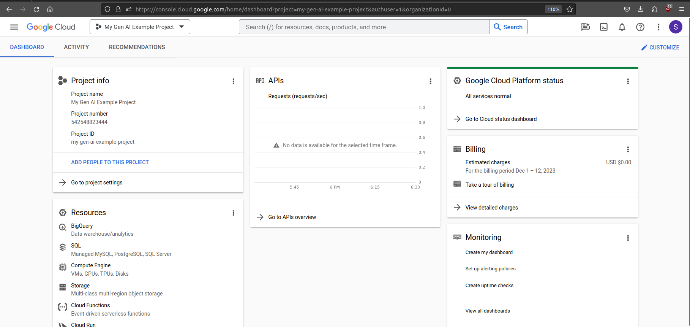

# Setting up your Google Project

First you need to create a Google Cloud project. You can do this by following Google's walk-through guide [here](https://developers.google.com/workspace/guides/create-project).

Once that's done, check out your new project in the Google Cloud Console. You should see something like this:



You'll need to link a billing account if you want to run the supervised tuning examples. I think everything else will work without billing enabled. Follow Google's guide here for [creating a billing account](https://cloud.google.com/billing/docs/how-to/create-billing-account).

## Setting up local gcloud config

First, set the `GCP_PROJECT` variable in the [.env](../../.env) to your new project id.

Run the one-time setup of the Google Cloud project config.

```sh
make gcloud_init
```

Activate the project config and handle auth. If you work on multiple projects, you'll need to run this each time you switch projects.

This also sets up a [docker credential helper](https://cloud.google.com/artifact-registry/docs/docker/authentication) so you can push docker images to the project's Google Container Registry and configures the `USER_EMAIL_ADDRESS` variable in [.env](../../.env) to the email address of the logged in user.

```sh
make gcloud_login
```

This will ask you to go to a URL, twice, to login with your email address that created the project, and copy+paste a key into the terminal. This is annoying, but it's setting up your normal user auth as well as [application default credentials](https://cloud.google.com/docs/authentication/provide-credentials-adc#local-dev).

## Project and Infrastructure Setup

This handles enabling the Google Cloud APIs you need in order to run the examples, creating a service account and storage bucket for fine-tuning job pipelines, and creating a minimally-scoped API key for a custom search engine example.

After setting up your local environment, run the following command from the root of the repository to see what Terraform will handle for you:
```sh
make terraform_plan
```

When you're comfortable with the changes Terraform is going to make, run the following command to apply them:
```sh
make terraform_apply
```

To destroy everything when you're done, run the following command:
```sh
make terraform_destroy
```

I also recommend deleting the project entirely when you're done. You can do this by going to the [Google Cloud Console](https://console.cloud.google.com/) and following the instructions here:
1. click on the project dropdown in the top left corner
2. in the top right hamburger menu (three dots) click on "Manage Projects"
3. in the far right column of the table of projects, click the three dots next to the project you want to delete and click `Delete`
